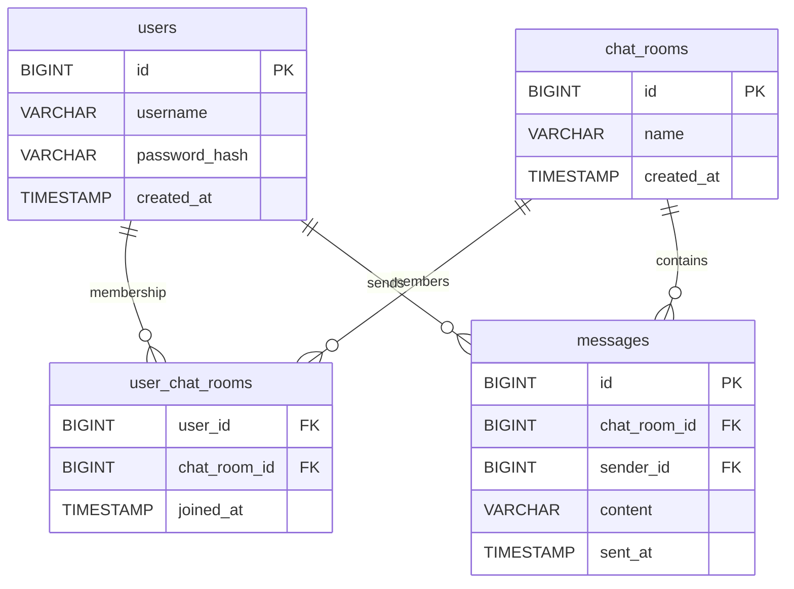

# Chat Project

## Описание

Этот проект представляет собой чат-приложение, включающее серверную и клиентскую части. Серверная часть обрабатывает соединения и взаимодействует с клиентами, а клиентская часть предназначена для отправки и получения сообщений от сервера.

## Участники команды

| Username                                            | Имя                         | Роль в команде    |
|-----------------------------------------------------|-----------------------------|-------------------|
| [@andreevich404](https://github.com/andreevich404)  | Толкачев Иван Андреевич     | Технический лидер |
| [@MarySim](https://github.com/MarySim)              | Симонова Марина Евгеньевна  | Разработчик       |
| [@reginaa11](https://github.com/reginaa11)          | Симоненко Регина Зиядиновна | Разработчик       |


## Структура проекта
- **[chat-client/](https://github.com/andreevich404/Chat/tree/develop/chat-client)** - Клиентская часть приложения.
- **[chat-server/](https://github.com/andreevich404/Chat/tree/develop/chat-server)** - Серверная часть приложения.

## ER-диаграмма


## Установка

Для работы с проектом необходимо установить следующие инструменты:

- [Java 21+](https://www.oracle.com/java/technologies/downloads/#java21) (для компиляции и запуска приложения).
- [Maven](https://maven.apache.org/install.html) (для управления зависимостями и сборки проекта).

### Клонирование репозитория

```bash
git clone https://github.com/andreevich404/Chat.git
cd Chat
```

## Сборка проекта

1. **Перейдите в директорию `chat-server` для сборки серверной части:**

```bash
cd chat-server
```

2. **Запустите сборку с помощью Maven:**

```bash
mvn clean install
```

3. **Перейдите в директорию `chat-client` для сборки клиентской части:**

```bash
cd ../chat-client
```

4. **Запустите сборку с помощью Maven:**

```bash
mvn clean install
```

## Запуск приложения

### Запуск серверной части

1. **Перейдите в директорию `chat-server`:**

```bash
cd chat-server
```

2. **Запустите сервер:**

```bash
mvn exec:java -Dexec.mainClass="org.example.ChatServer"
```

Сервер будет слушать соединения на порту 8080 (или другом, если вы настроили).

### Запуск клиентской части

1. **Перейдите в директорию `chat-client`:**

```bash
cd chat-client
```

2. **Запустите клиент:**

```bash
mvn exec:java -Dexec.mainClass="org.example.ChatClient"
```

Клиент подключится к серверу и будет готов к отправке и получению сообщений.

## Конфигурация

Проект использует файл **.env** для хранения конфиденциальных данных, таких как переменные окружения для подключения к серверу или базе данных. Убедитесь, что файл **.env** присутствует и содержит нужные данные:

```
SERVER_HOST=localhost
SERVER_PORT=8080
```